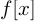
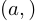
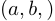
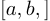
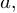
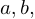
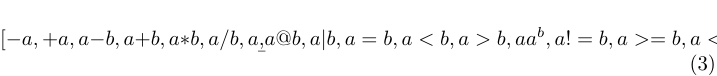

# EXPLICIT CONTROL:

Enable explicit processing with curly brackets.
For inline processing use  without new lines and
for block processing use 


 with at least one new line (and optional indentation).
Labeling works as  or 


Anything inside curly brackets has to be a valid expression.

Enable explicit inline latex math with \(a\) and
explicit block latex math with \[a.\] No
processing is performed and nothing is enforced for explicit latex math.

No processing is performed inside inline markdown formatting
such as *italic*, **bold**, ***bolditalic***, ~~strikethrough~~, `verbatim` or
[links](http://github.com). Processing is performed inside "block" markdown
formatting such as headers, lists or quotes.


Calls: ,  or .
Tuples: , , , 
Lists: , , , , 
Sets: , , , , 

Unary and binary operations: 




```


# IMPLICIT PROCESSING:

Disable implicit processing with md-code fences.
Anything for which processing begins with an indented new line will be
block processed, otherwise it will be inline processed.

Any valid binary mathematical operation will enter processing mode
except for `-`, `@` and word operators such as `in`.

For example, will be processed, but non-positive or foo@bar.com won't be.

Valid tuples (a,b,c), lists [a,b,c] and sets {a,b,c} will be processed as well.
Single element containers require a trailing comma such as (a,), [b,] or {c,}.

```
