### Proposition:

Let
   be a real number and
  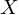 be an RV with
    PDF 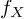,
    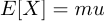 and
    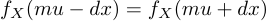 for all real numbers dx.
Then 

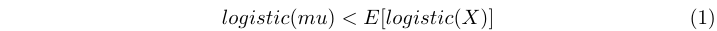

### Proof:

For sake of brevity we introduce 

 The expectation of w(X) = logistic(X) is defined as 

 A linear change of variables yields 

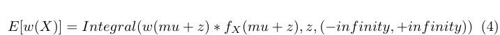

 and "folding the integral at z=0" yields 

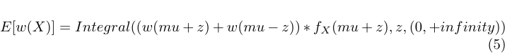

 where we used the symmetry of  around 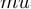.

To show that 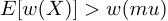 it is sufficient to show that

 almost everywhere for fixed  because then 

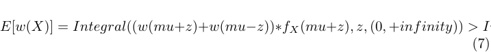

We now show that 

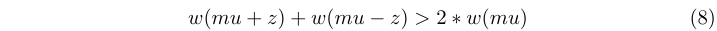

 for negative mu and nonzero real z.
Using the definition of w and combining all fractions to one we get

 with

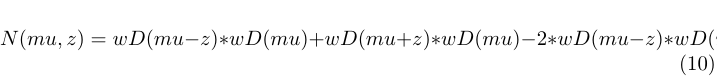

 and 

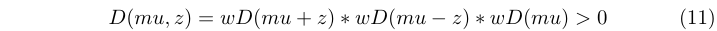

 using the abbreviation 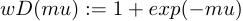. To show that 

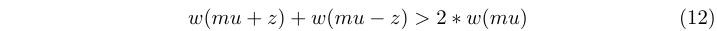

  for nonzero z it is sufficient to show that 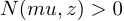. Expanding all products in the
definition of 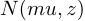 yields 

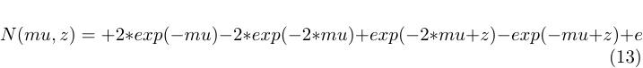

 As 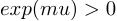 for all real numbers mu we get 

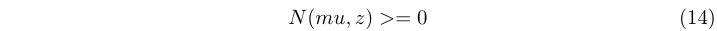

 iff 

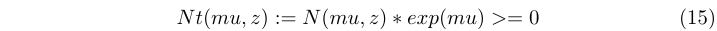

 We get 

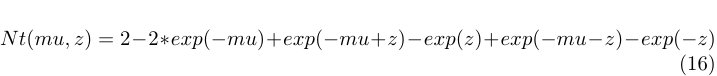

 Direct computation reveals that 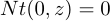. Furthermore we can compute 

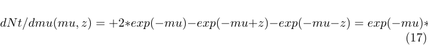

Elementary analysis reveals 

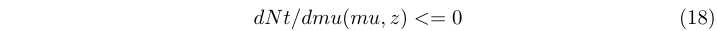

 with the inequality being strict if . From the fundamental theorem of calculus
we have that 

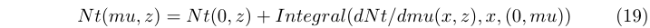

 for any real number mu. Using
  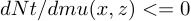 almost everywhere,
   and
  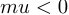
we can bound 

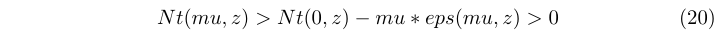

 for some 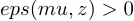.
